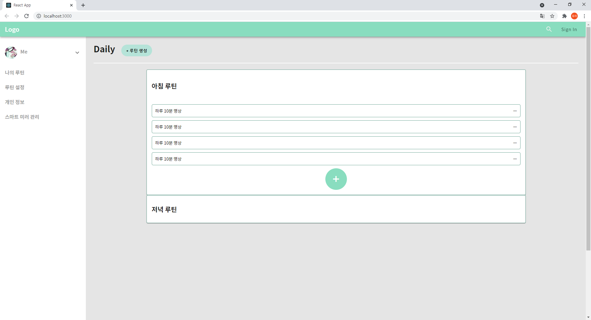
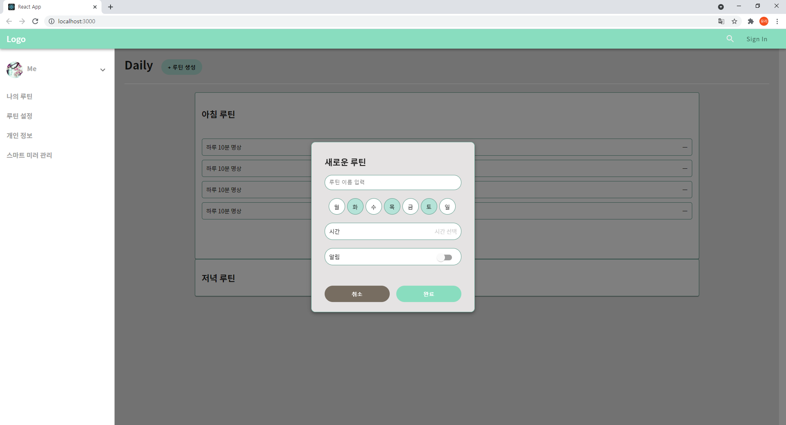
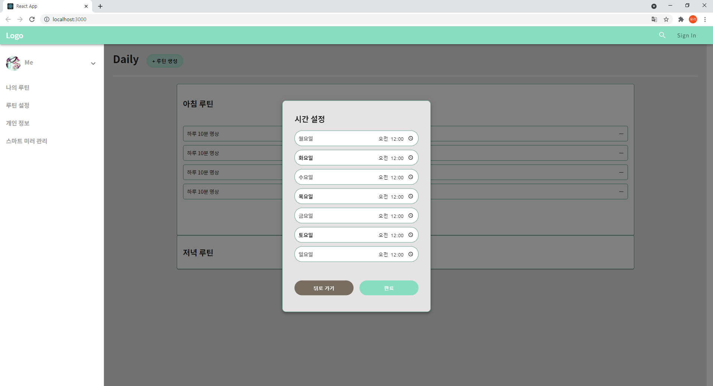
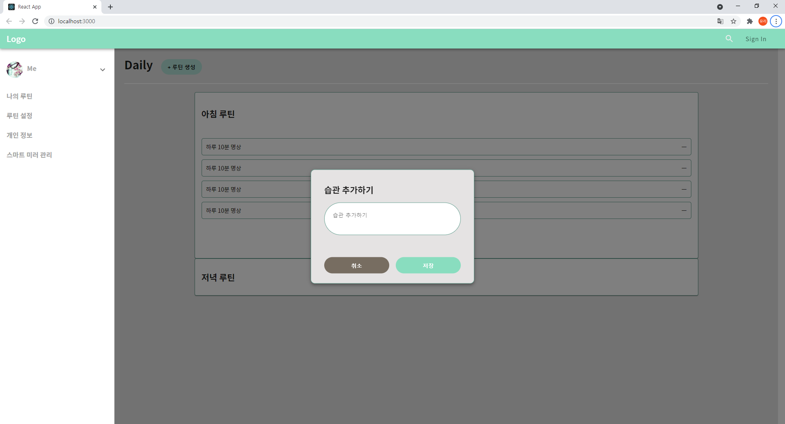

# MYME (Make Your Miracle Effectively)

[TOC]

##  

## 프로젝트 소개
### MYME (Make Your Miracle Effectively)
당신의 일과를 루틴화 해보세요!

아침 루틴, 점심 루틴, 저녁 루틴에 들어갈 항목을 만들고 추가해보세요!
간단한 항목부터 다른 사람과 공유할 수 있는 챌린지까지 루틴화 시킬 수 있습니다.

해당 루틴을 스마트 미러에 연동하여 쉽게 관리하고 확인할 수 있습니다.
하루하루 꾸준히 당신의 루틴을 지키며 성장합시다!!
 

## Private History - 백유리

### 3주차

- __07-27__ : React 기초 공부

- __07-28__ : 루틴 설정 관련 컴포넌트 설계 및 구현

- __07-29__ : 루틴 설정 페이지 UI 구현 / Header, Drawer 구현

- __07-30__ : 중간 발표 준비

   

## 결과물
1. 리액트 기초 학습
   - [TIL 보러가기](리액트 공부.md)
2. Header, Drawer 디자인, 루틴생성페이지 구현

3. 루틴 생성 모달 구현

4. 루틴 생성 모달 > 시간 설정 구현

5. 습관 생성 모달 구현

